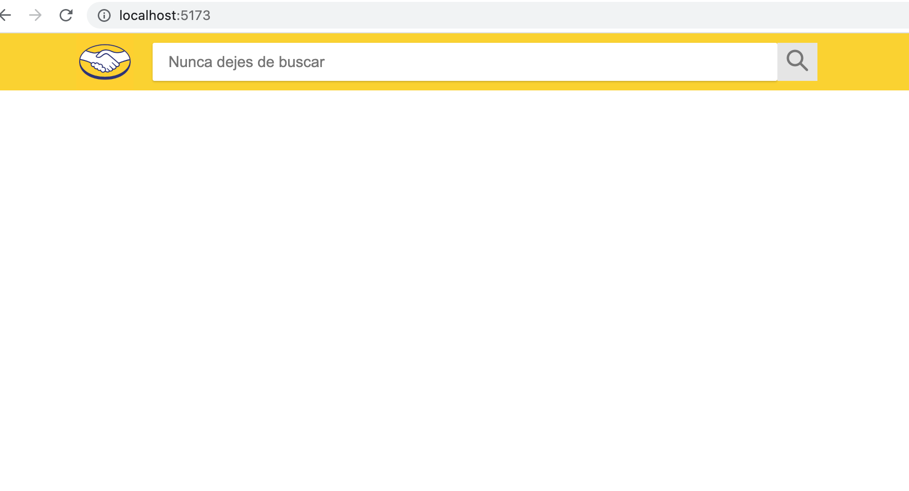
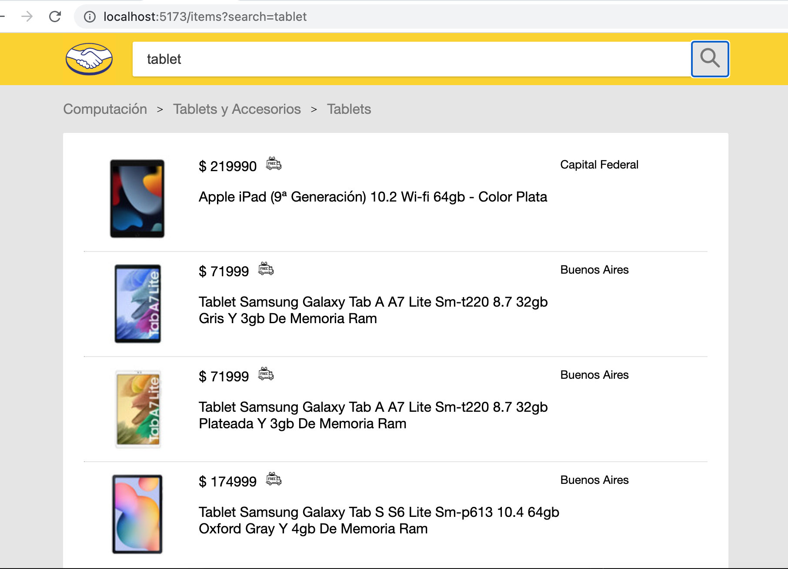
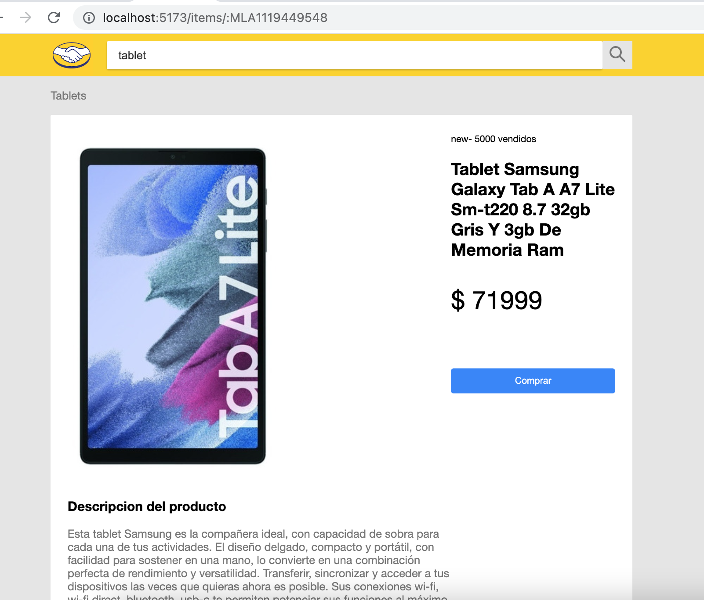

# front-end-test

This is a project that consists of a server and client folder. The server folder uses Express to create two endpoints that allows the client to request data from an external API, while the client folder is a React app that uses Vite as a bundler and development server.

The purpose of this application is to provide a simple interface to search for products and display their details. The app has three main components: the search box, the results view, and the product details description. Users can enter a search query in the search box, and the app will retrieve relevant results from the external API. The results view displays a list of products, and users can click on a product to see its details in the description section.

## Getting Started

To get started with this project, you'll need to do the following:

- Clone the repository to your local machine
- Navigate to the server folder and run `npm install` to install the required dependencies
- Next, run `npm start` to start the server
- Navigate to the client folder and run `npm install` to install the required dependencies
- Finally, run `npm run dev` to start the client app

## Server

The server folder contains an Express app that creates two endpoints. This app is built using the following technologies:

- Express.js

### Running the Server

To run the server, navigate to the server folder and run `npm start`. This will start the server on `http://localhost:3000`.

### API Endpoints

The server creates two endpoints:

- `/api/items`: This endpoint takes a search query as a parameter and returns a list of results.
- `/api/items/:id`: This endpoint takes an ID as a parameter and returns the details for that item.

## Client

The client folder contains a React app that uses Vite as its development server. This app is built using the following technologies:

- React.js
- Vite.js

### Running the Client

To run the client, navigate to the client folder and run `npm run dev`. This will start the development server on `http://localhost:5173/`.

### Pages

The client app consists of three pages:

- Search Box: This page allows users to enter a search query and submit it to the server.

- Results List: This page displays the results of the search query as a list of items. Users can click on an item to view its details.

- Details Page: This page displays the details of a selected item.

